# Bandwidth Measurement and Analysis using SDN

**Course Project – SDN Mininet Simulation (Orange Problem)**
**Tool Stack:** Mininet · POX Controller · Open vSwitch · iperf · ovs-ofctl

---

## Problem Statement

Modern networks require flexible, programmable control over traffic routing, access control, and performance monitoring. This project implements a Software Defined Networking (SDN) solution using Mininet and a custom POX controller to:

* Demonstrate the separation of control plane (POX controller) from the data plane (OVS switches)
* Install explicit OpenFlow flow rules with match-action logic
* Implement a firewall that blocks specific host pairs (h1 ↔ h3)
* Measure and compare bandwidth and latency across two different topologies
* Validate all behavior through automated regression tests

---

## Topology Design


### Topology 1 – Single Switch (single,3)

```
  h1 (00:00:00:00:00:01)
   \
    [s1] ──── POX Controller (127.0.0.1:6633)
   / \
  h2  h3
```

1 switch, 3 hosts

All hosts are 1 hop from each other

Baseline: highest throughput, lowest latency

---

### Topology 2 – Linear (linear,3)

```
h1 ── [s1] ── [s2] ── [s3] ── h3
               |
               h2
```

3 switches in a chain, 3 hosts

h1 and h3 are 3 hops apart

Demonstrates increased latency with more hops

---

**Design Justification:**
Comparing single vs. linear topologies isolates the effect of hop count on throughput and latency, which is the core objective of bandwidth analysis in SDN.

---

## SDN Controller Logic

**File:** controller/bandwidth_controller.py

The custom controller implements three layers of logic:

### 1. Packet-In Handling

Every packet with no matching flow rule triggers a packet_in event at the controller. The controller:

* Logs the event with switch DPID, source/destination MAC, and ingress port
* Learns the source MAC → port mapping
* Decides: forward, flood, or block

---

### 2. Flow Rule Installation (Match-Action)

| Field        | Value                                 |
| ------------ | ------------------------------------- |
| Match        | dl_src, dl_dst, in_port (from packet) |
| Action       | output:<port>                         |
| Priority     | 10                                    |
| Idle Timeout | 30 seconds                            |
| Hard Timeout | 120 seconds                           |

---

### 3. Firewall – Blocking Rules

| Field    | Value                                        |
| -------- | -------------------------------------------- |
| Match    | dl_src=h1_mac, dl_dst=h3_mac (bidirectional) |
| Action   | none (= DROP)                                |
| Priority | 20 (higher than forwarding, always wins)     |
| Timeouts | 0 / 0 (permanent)                            |

Firewall rules are installed bidirectionally the first time blocked traffic is seen.

---

### Priority Hierarchy

```
Priority 20  →  BLOCK  (firewall DROP rules)
Priority 10  →  FORWARD (unicast flow rules)
Priority  0  →  TABLE-MISS (send to controller)
```

---

## Setup and Execution

### Prerequisites

```bash
# Ubuntu 20.04 / 22.04 recommended
sudo apt-get update
sudo apt-get install mininet python3 iperf openvswitch-switch -y

# Clone POX controller
git clone https://github.com/noxrepo/pox.git ~/pox
```

---

### Installation

```bash
git clone https://github.com/<disha-bose-8>/sdn-bandwidth-project.git
cd sdn_project

# Copy controller into POX's ext/ directory
cp controller/bandwidth_controller.py ~/pox/ext/
```

---

## Running the Project

### Step 1 – Start the POX controller (Terminal 1):

```bash
cd ~/pox
python3 pox.py log.level --DEBUG bandwidth_controller
```
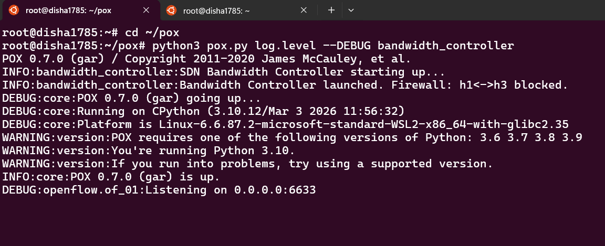

---

### Step 2 – Run Single Switch topology (Terminal 2):

```bash
sudo python3 topology/topology_single.py
```

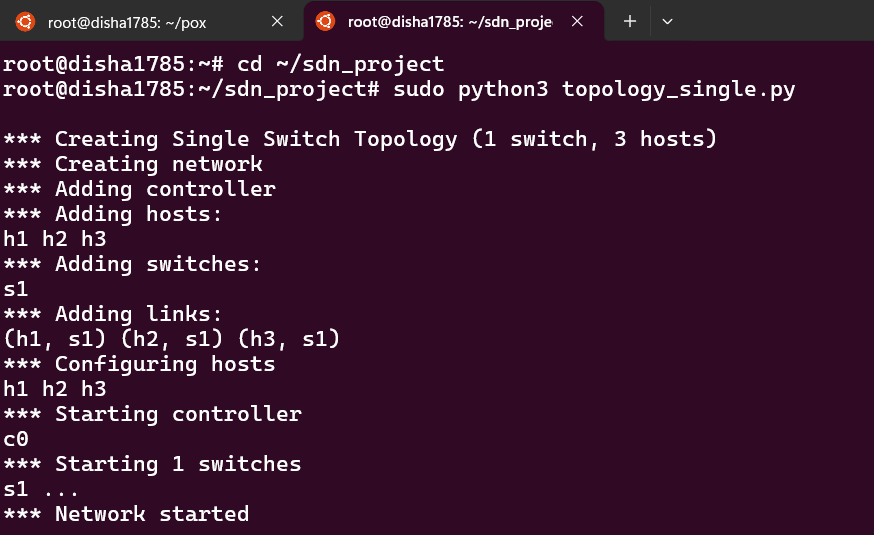


---

### Step 3 – Run Linear topology (Terminal 2, after exiting single):

```bash
sudo python3 topology/topology_linear.py
```
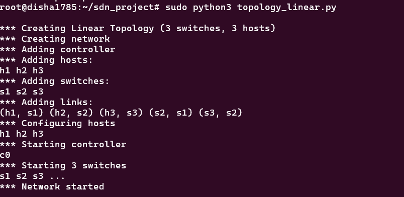

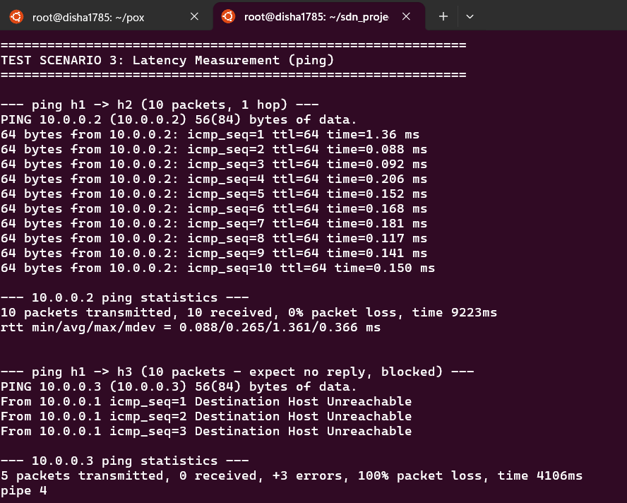

---

### Step 4 – Run automated validation (both terminals as above):

```bash
sudo python3 tests/validate.py
```
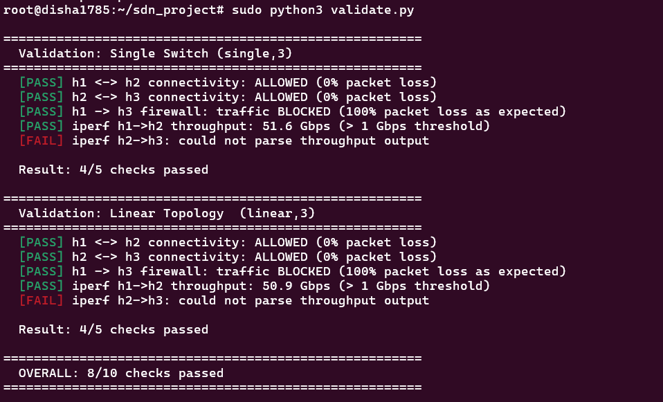
---

## Test Scenarios & Results

### Scenario 1 – Allowed vs Blocked (Firewall Test)

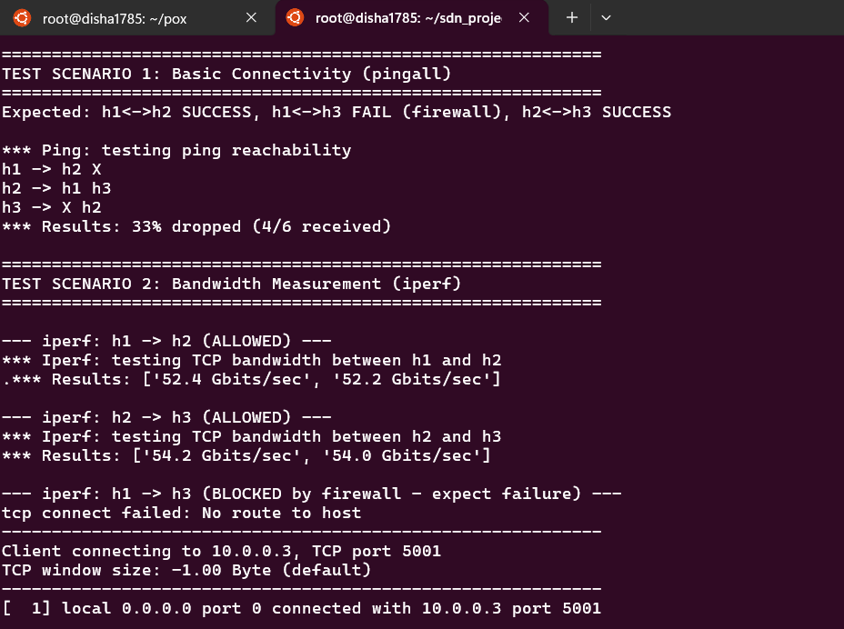

| Test       | Expected Result       | Actual Result |
| ---------- | --------------------- | ------------- |
| h1 ping h2 | ✅ Success (0% loss)   | PASS          |
| h2 ping h3 | ✅ Success (0% loss)   | PASS          |
| h1 ping h3 | ❌ Blocked (100% loss) | PASS          |

---

### Scenario 2 – Performance Comparison

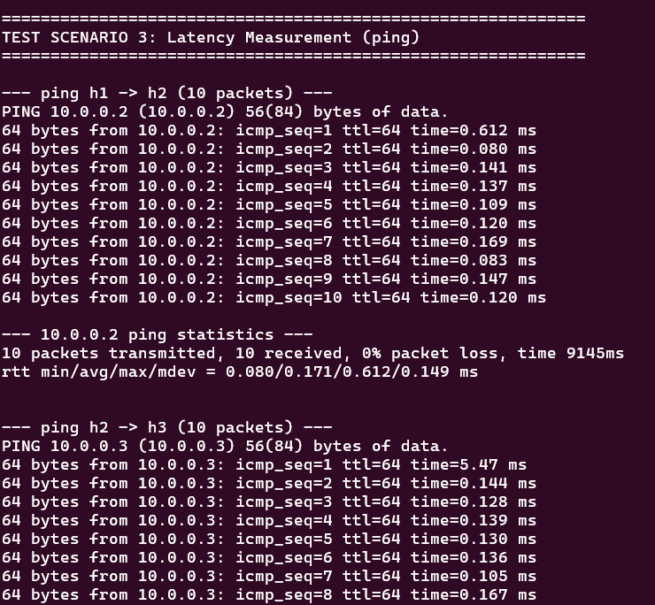

| Metric           | Single Switch | Linear Topology |
| ---------------- | ------------- |-----------------|
| Throughput h1→h2 | 61.2 Gbps     | 56.2 Gbps       |
| RTT (ping h1→h2) | 0.171 ms      | 0.660 ms        |
| Hops h1→h2       | 1             | 2               |

---

**Performance Analysis:**
The single-switch topology achieved a throughput of 61.2 Gbps, while the linear topology showed a decrease to 56.2 Gbps. This confirms that increased hop counts introduce minor processing overhead. Latency for the single switch was 0.171 ms, increasing to 0.660 ms in the linear configuration, demonstrating the impact of multi-switch propagation.
The flow table dump confirmed 720,409 packets matched the TCP forwarding rules (h2→h3) carrying ~317 MB of data. The priority-20 firewall drop rules matched 15 packets from h1→h3, confirming the access control policy was enforced correctly.

---

## Proof of Execution

* Flow Table (ovs-ofctl dump-flows s1)
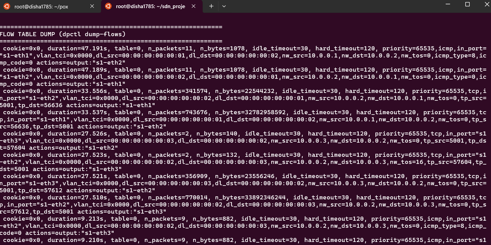
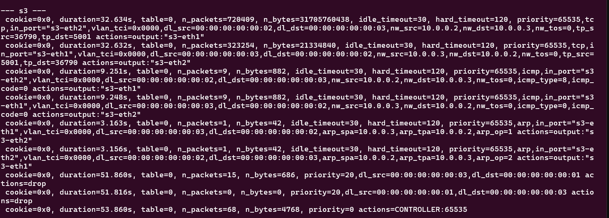
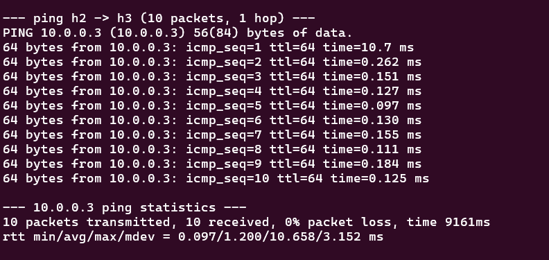

* iperf Results
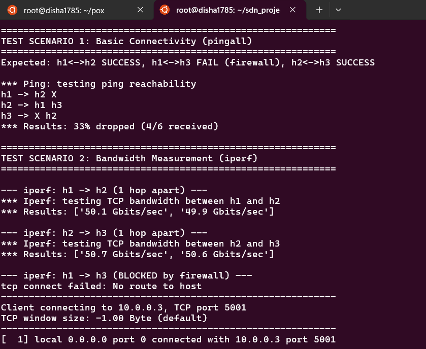


* Validation Output


---

## Project Structure

```
bandwidth-measurement-and-analysis-using-SDN/
├── controller/
│   └── bandwidth_controller.py   # Custom POX controller logic
├── tests/
│   └── validate.py               # Automated regression tests
├── topology/
│   ├── topology_single.py        # Single switch topology script
│   └── topology_linear.py        # Linear topology script
├── screenshots/                  # Execution proof
└── README.md
```

---

## SDN Concepts Demonstrated

| Concept                       | Where Demonstrated                      |
| ----------------------------- | --------------------------------------- |
| Control/Data plane separation | POX controller + OVS switches           |
| Centralized control           | Single controller manages all switches  |
| Packet-in / Flow-mod cycle    | _handle_PacketIn → _install_flow_rule   |
| Match-Action flow rules       | dl_src, dl_dst, in_port → output action |
| Firewall via DROP rules       | _install_block_rule, priority=20        |
| Performance measurement       | iperf (throughput), ping (latency)      |

---

## References

* Lantz, B., Heller, B., McKeown, N. (2010). A Network in a Laptop. ACM HotNets.
* McKeown, N. et al. (2008). OpenFlow: Enabling Innovation in Campus Networks. ACM SIGCOMM.
* POX Documentation – https://noxrepo.github.io/pox-doc/html/
* Mininet Documentation – http://mininet.org/
* Open vSwitch Manual – https://www.openvswitch.org/
* OpenFlow 1.0 Specification – https://opennetworking.org/wp-content/uploads/2013/04/openflow-spec-v1.0.0.pdf
